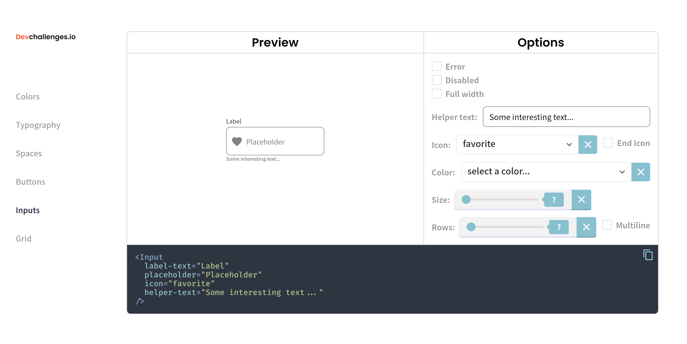
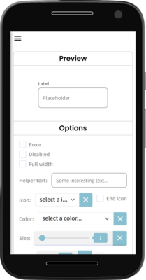

<h1 align="center">input-component</h1>

<div align="center">
   Solution for a challenge from  <a href="http://devchallenges.io" target="_blank">Devchallenges.io</a>.
</div>

<div align="center">
  <h3>
    <a href="https://input-component-danielpaz98.vercel.app" target="_blank">
      Demo
    </a>
    <span> | </span>
    <a href="https://github.com/danielpaz98/input-component" target="_blank">
      Solution
    </a>
    <span> | </span>
    <a href="https://devchallenges.io/challenges/ohgVTyJCbm5OZyTB2gNY" target="_blank">
      Challenge
    </a>
  </h3>
</div>

<!-- TABLE OF CONTENTS -->

## Table of Contents

- [Overview](#overview)
- [Built With](#built-with)
- [Features](#features)
- [How to use](#how-to-use)
- [Acknowledgements](#acknowledgements)
- [Contact](#contact)

<!-- OVERVIEW -->

## Overview

<h3 align="center">Desktop</h3>

<div align="center">
	
</div>

<h3 align="center">Mobile</h3>

<div align="center">
	
</div>

<br />

Good opportunity to practice with Vue and learn what's new in its composition api.

### Built With

- [Vue](https://vuejs.org/)
- [Vite.js](https://vitejs.dev/)

## Features

This application/site was created as a submission to a [DevChallenges](https://devchallenges.io/challenges) challenge. The [challenge](https://devchallenges.io/challenges/ohgVTyJCbm5OZyTB2gNY) was to build an application to complete the given user stories.

## How To Use

To clone and run this application, you'll need [Git](https://git-scm.com) and [Node.js](https://nodejs.org/en/download/) (which comes with [npm](http://npmjs.com)) installed on your computer. From your command line:

```bash
# Clone this repository
$ git clone https://github.com/your-user-name/your-project-name

# Install dependencies
$ npm install

# Serve with hot reload at localhost:3000
$ npm run dev

# Build for production and launch server
$ npm run build
$ npm run serve
```

## Acknowledgements

- devchallenges.io

## Contact

- GitHub [@danielpaz98](https://github.com/danielpaz98)
- Twitter [@dapaz_98](https://twitter.com/dapaz_98)
